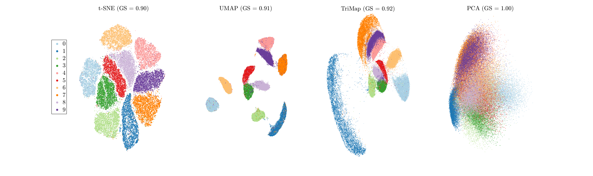
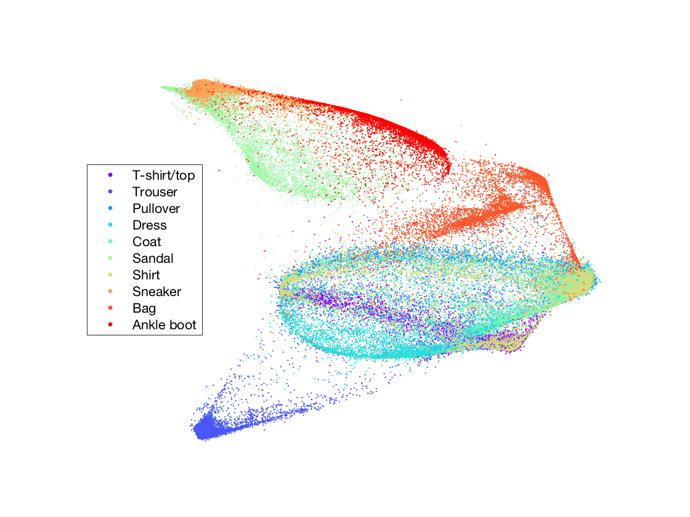
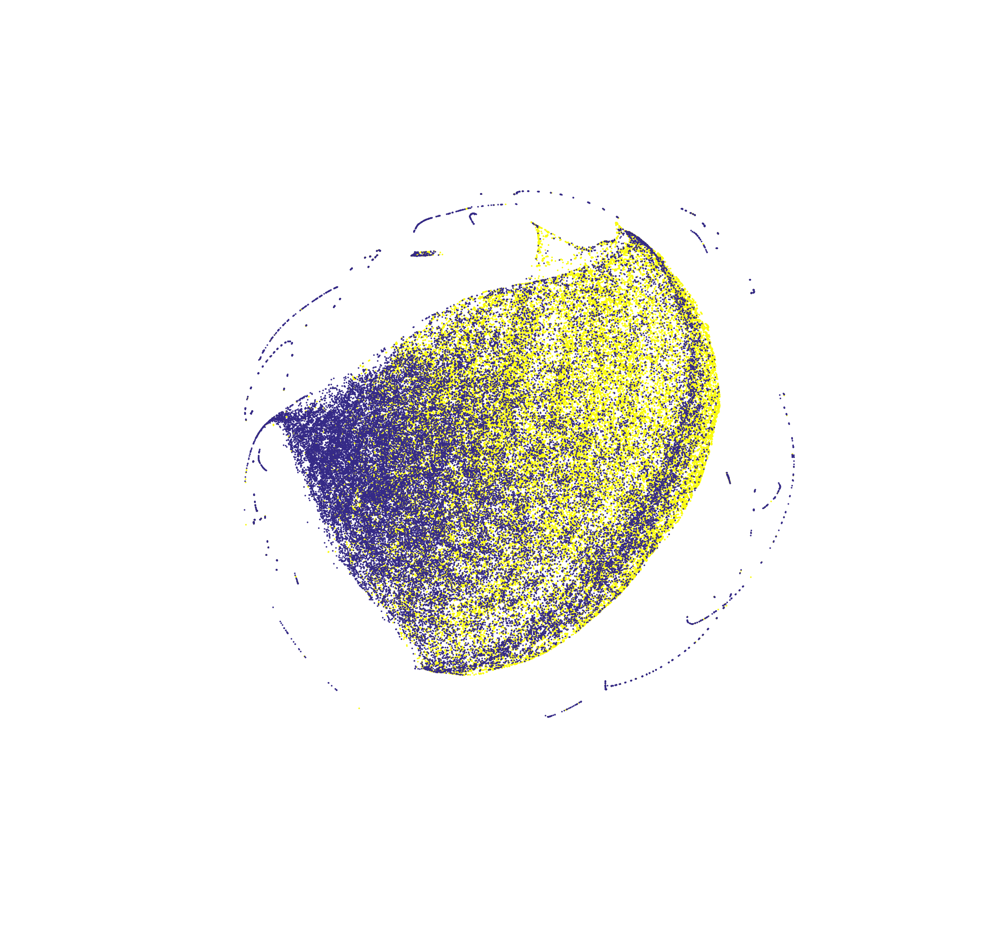
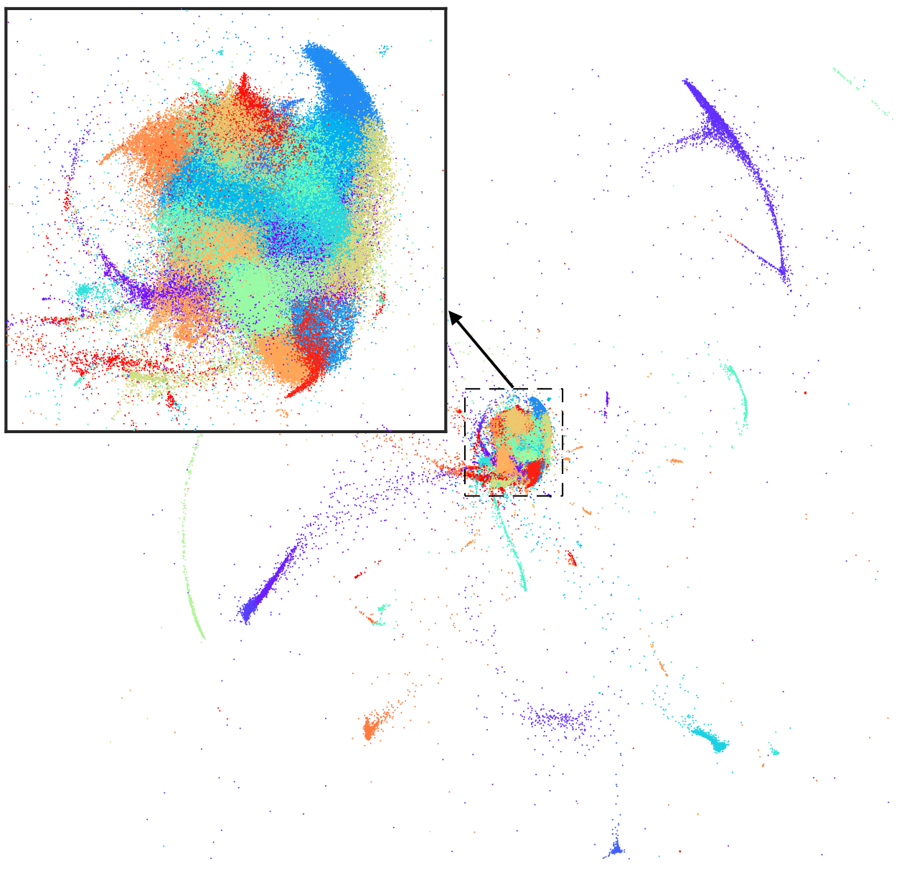

======
TriMap
======

TriMap is a dimensionality reduction method that uses triplet constraints
to form a low dimensional embedding of a set of points. The triplet constraints
are of the form "point *i* is closer to point *j* than point *k*". The triplets are 
sampled from the high-dimensional reprsesentation of the points and a weighting 
scheme is used to reflect the importance of each triplet. 

TriMap provides a much better global view of the data than the
other dimensionality reduction methods such t-SNE, LargeVis, and UMAP. The global 
structure includes relative distances of the clusters, multiple scales in 
the data, and the existence of possible outliers. 

The following implementation is in Python. 

-----------------
How to use TriMap
-----------------

TriMap enjoys a transformer API similiar to other sklearn libraries. To use 
TriMap with the default parameters, simply do:

.. code:: python

    import trimap
    from sklearn.datasets import load_digits

    digits = load_digits()

    embedding = trimap.TRIMAP().fit_transform(digits.data)

-----------------
Parameters
-----------------

Unlike other dimensionality reduction method, TriMap only has a few parameters
to tune:

 -  ``n_inliers``: Number of nearest neighbors for forming the nearest neighbor triplets (default = 10).

 -  ``n_outliers``: Number of outliers for forming the nearest neighbor triplets (default = 5).

 -  ``n_random``: Number of random triplets per point (default = 5).

 -  ``lr``: Learning rate (default = 1000.0).

 -  ``n_iters``: Number of iterations (default = 400).
 
The other parameters include:

 -  ``weight_adj``: Adjust weights for extreme outliers using a log-transformation (default = True).

 -  ``fast_trimap``: Use only ANNOY for nearest-neighbor search (default = True).

 -  ``opt_method``: Optimization method {'sd' (steepest descent), 'momentum' (GD with momentum), 'dbd' (delta-bar-delta, default)}.

 -  ``verbose``: Print the progress report (default = True).

 -  ``return_seq``: Store the intermediate results and return the results in a tensor (default = False).

An example of adjusting these parameters:

.. code:: python

    import trimap
    from sklearn.datasets import load_digits

    digits = load_digits()

    embedding = trimap.TRIMAP(n_inliers=10,
                              n_outliers=5,
                              n_random=5).fit_transform(digits.data)

The nearest-neighbor calculation is performed by default using  `ANNOY <https://github.com/spotify/annoy>`_. For more accurate results, the first 5 nearest-neighbors of each point can be calculated using ``sklearn.neighbors.NearestNeighbors`` and the results can be combined with those calculated using ANNOY. However, this may significantly increase the runtime. The ``fast_trimap (default = True)`` argument controls this property. For more accurate results, set ``fast_trimap = False``.

--------
Examples
--------

The following are some results on real-world datasets. For more results, please refer
to our paper.

MNIST Handwritten Digits (*n = 70,000, d = 784*)

Fashion MNIST (*n = 70,000, d = 784*)

    
Tabula Muris (*n = 53,760, d = 23,433*)

.. image:: results/tabula_muris_trimap.png
    :alt: TriMap embedding of the Tabula Muris Mouse Tissues dataset

TV News (*n = 129,685, d = 50*)

380k+ Lyrics (*n = 266,557, d = 256*)

----------
Installing
----------

Requirements:

* numpy
* scikit-learn
* numba
* annoy

**Install Options**

If you have all the requirements installed, you can use pip:

.. code:: bash

    sudo pip install trimap
    
Please regularly check for updates and make sure you are using the most recent version. If you have TriMap installed and would like to upgrade to the newer version, you can use the command:

.. code:: bash

    sudo pip install --upgrade --force-reinstall trimap

An alternative is to install the dependencies manually using anaconda and using pip 
to install TriMap:

.. code:: bash

    conda install numpy
    conda install scikit-learn
    conda install numba
    conda install annoy
    pip install trimap

For a manual install get this package:

.. code:: bash

    wget https://github.com/eamid/trimap/archive/master.zip
    unzip master.zip
    rm master.zip
    cd trimap-master

Install the requirements

.. code:: bash

    sudo pip install -r requirements.txt

or

.. code:: bash

    conda install scikit-learn numba annoy

Install the package

.. code:: bash

    python setup.py install

------------------------
Support and Contribution
------------------------

This implementation is still a work in progress. Any comments/suggestions/bug-reports
are highly appreciated. Please feel free contact me at: eamid@ucsc.edu. If you would 
like to contribute to the code, please `fork the project <https://github.com/eamid/trimap/issues#fork-destination-box>`_
and send me a pull request.

--------
Citation
--------

If you use TriMap, please cite our current reference on ArXiv:

::

   @article{2018TRIMAP,
        author = {{Amid}, E. and {Warmuth}, M. K.},
        title = "{A more globally accurate dimensionality reduction method using triplets}",
        journal = {ArXiv e-prints},
        archivePrefix = "arXiv",
        eprint = {1803.00854},
        year = 2018,
        month = march,
   }

-------
License
-------

Please see the LICENSE file.

