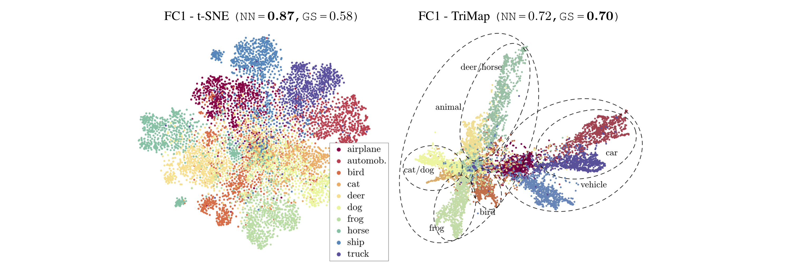
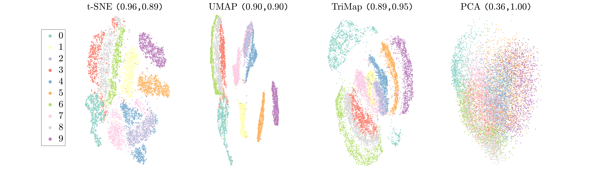
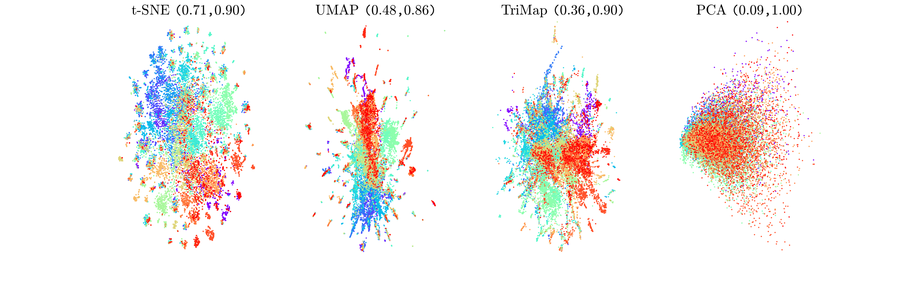
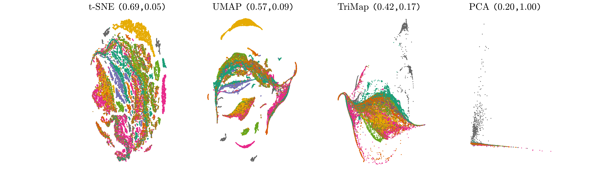
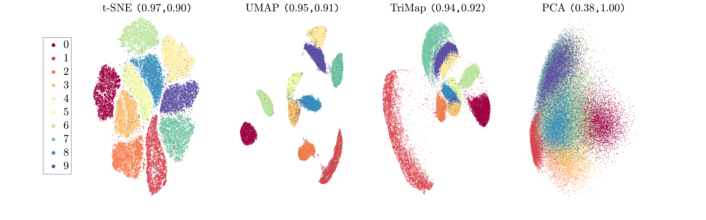
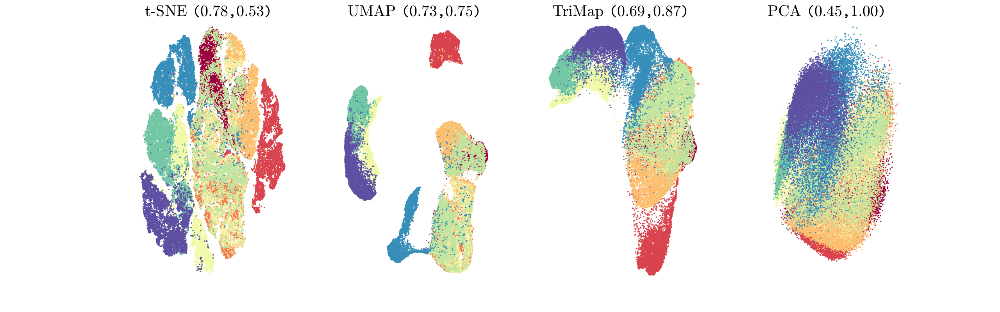
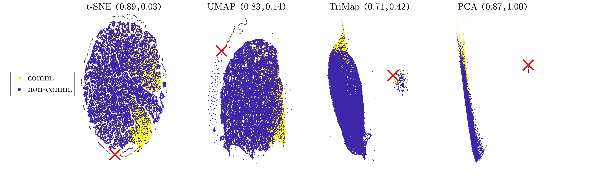
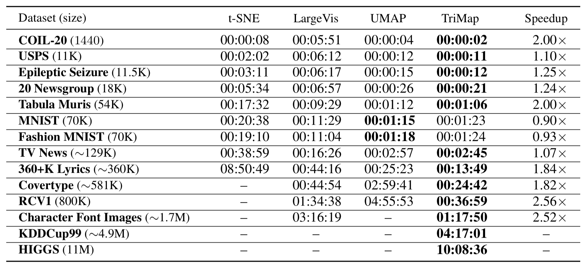

======
TriMap
======

TriMap is a dimensionality reduction method that uses triplet constraints
to form a low-dimensional embedding of a set of points. The triplet constraints
are of the form "point *i* is closer to point *j* than point *k*". The triplets are 
sampled from the high-dimensional representation of the points and a weighting 
scheme is used to reflect the importance of each triplet. 

TriMap provides a significantly better global view of the data than the
other dimensionality reduction methods such t-SNE, LargeVis, and UMAP. The global 
structure includes relative distances of the clusters, multiple scales in 
the data, and the existence of possible outliers. We define a global score to quantify the quality of an embedding in reflecting the global structure of the data.

CIFAR-10 dataset (test set) passed through a CNN (*n = 10,000, d = 1024*): Notice the semantic structure unveiled by TriMap.

The following implementation is in Python. Further details and more experimental results are available in the `paper <https://arxiv.org/abs/1910.00204>`_. See the `example colab <https://github.com/eamid/examples/blob/master/TriMap.ipynb>`_ for some analysis.

-----------------
News!
-----------------

[Aug 18, 2026] A GPU-parallel PyTorch implementation is now available as
``trimap.TorchTRIMAP``, with support for CUDA, MPS, and CPU.

[Mar 16, 2022] An example colab using TriMap `JAX implementation <https://github.com/google-research/google-research/tree/master/trimap>`_ is now available at https://github.com/eamid/examples/blob/master/TriMap.ipynb. We analyze the results on S-curve, MNIST, Fashion MNIST, etc. using t-SNE, UMAP, TriMap, and PCA.

[Feb 17, 2022] A JAX implementation is now available at https://github.com/google-research/google-research/tree/master/trimap. More updates are coming soon!

-----------------
How to use TriMap
-----------------

TriMap has a transformer API similar to other sklearn libraries. To use 
TriMap with the default parameters, simply do:

.. code:: python

    import trimap
    from sklearn.datasets import load_digits

    digits = load_digits()

    embedding = trimap.TRIMAP().fit_transform(digits.data)

To find the embedding using a precomputed pairwise distance matrix D, pass D as input and set use_dist_matrix to True:

.. code:: python

    embedding = trimap.TRIMAP(use_dist_matrix=True).fit_transform(D)

You can also pass the precomputed k-nearest neighbors and their corresponding distances as a tuple (knn_nbrs, knn_distances). Note that the rows must be in order, starting from point 0 to n-1. This feature also requires X to compute the embedding

.. code:: python

    embedding = trimap.TRIMAP(knn_tuple=(knn_nbrs, knn_distances)).fit_transform(X)

To calculate the global score, do:

.. code:: python

    gs = trimap.TRIMAP(verbose=False).global_score(digits.data, embedding)
    print("global score %2.2f" % gs)

-----------------
Parameters
-----------------

The list of parameters is given blow:

 -  ``n_dims``: Number of dimensions of the embedding (default = 2)

 -  ``n_inliers``: Number of nearest neighbors for forming the nearest neighbor triplets (default = 12).

 -  ``n_outliers``: Number of outliers for forming the nearest neighbor triplets (default = 4).

 -  ``n_random``: Number of random triplets per point (default = 3).

 -  ``distance``: Distance measure ('euclidean' (default), 'manhattan', 'angular' (or 'cosine'), 'hamming')

 -  ``weight_temp``: Temperature of the logarithm applied to the weights. Larger temperatures generate more compact embeddings. weight_temp=0. corresponds to no transformation (default=0.5).

 -  ``weight_adj`` (deprecated): The value of gamma for the log-transformation (default = 500.0).

 -  ``lr``: Learning rate (default = 0.1).

 -  ``n_iters``: Number of iterations (default = 400).
 
The other parameters include:

 -  ``knn_tuple``: Use the precomputed nearest-neighbors information in form of a tuple (knn_nbrs, knn_distances) (default = None)

 -  ``use_dist_matrix``: Use the precomputed pairwise distance matrix (default = False)

 -  ``apply_pca``: Reduce the number of dimensions of the data to 100 if necessary before applying the nearest-neighbor search (default = True).

 -  ``opt_method``: Optimization method {'sd' (steepest descent), 'momentum' (GD with momentum), 'dbd' (delta-bar-delta, default)}.

 -  ``verbose``: Print the progress report (default = False).

 -  ``return_seq``: Store the intermediate results and return the results in a tensor (default = False).

An example of adjusting these parameters:

.. code:: python

    import trimap
    from sklearn.datasets import load_digits

    digits = load_digits()

    embedding = trimap.TRIMAP(n_inliers=20,
                              n_outliers=10,
                              n_random=10).fit_transform(digits.data)

The nearest-neighbor calculation in the legacy implementation is performed
using `ANNOY <https://github.com/spotify/annoy>`_.

----------------------------
GPU-parallel PyTorch version
----------------------------

``TorchTRIMAP`` is a tensor-native implementation of the complete pipeline. It
keeps preprocessing, nearest-neighbor results, triplets, weights, the loss,
gradient, optimizer state, and embedding on the selected accelerator. The
native nearest-neighbor search is exact and blocked, so it does not allocate an
``n x n`` distance matrix.

A single ``import trimap`` exposes both estimator APIs:

.. code:: python

    import trimap

    legacy_model = trimap.TRIMAP()
    torch_model = trimap.TorchTRIMAP(device="cuda")

``trimap.TRIMAP`` is the legacy NumPy/Numba implementation, while
``trimap.TorchTRIMAP`` runs the tensor-native pipeline. Both provide
``fit_transform``. A NumPy array can be passed directly to the PyTorch version;
it is moved to the selected device before preprocessing:

.. code:: python

    import numpy as np
    import trimap
    from sklearn.datasets import load_digits

    X = np.asarray(load_digits().data, dtype=np.float32)
    model = trimap.TorchTRIMAP(
        device="cuda",
        knn_backend="auto",
        n_iters=400,
        random_state=42,
        triplet_batch_size=1_000_000,
    )

    embedding = model.fit_transform(X)
    embedding_numpy = embedding.detach().cpu().numpy()

The returned embedding is a PyTorch tensor on the input/selected device. Use
``embedding.detach().cpu().numpy()`` only when a NumPy consumer needs it. The
pipeline runs preprocessing/PCA, nearest-neighbor search, triplet and weight
construction, initialization, and gradient-descent optimization on that
device.

For a large CUDA data set such as Covertype, after removing its target column:

.. code:: python

    model = trimap.TorchTRIMAP(
        device="cuda",
        knn_backend="cuvs-cagra",
        gradient="explicit",
        n_iters=400,
        random_state=42,
        triplet_batch_size=30_000_000,
    )
    embedding = model.fit_transform(X[:, :54])

Nearest-neighbor backends
-------------------------

The PyTorch implementation does not use Annoy. It supports these open-source
alternatives:

* ``torch``: exact batched search with ``torch.cdist``/matrix multiplication;
  supports CUDA, MPS, CPU, and every TriMap distance.
* ``faiss-flat`` (or ``faiss``): exact `Faiss
  <https://github.com/facebookresearch/faiss>`_ Flat search for Euclidean/cosine
  data. A CUDA-enabled Faiss build accepts resident PyTorch tensors directly.
* ``faiss-ivf``: approximate inverted-file search for large data sets.
* ``cuvs-cagra``: `NVIDIA cuVS <https://github.com/rapidsai/cuvs>`_ CAGRA, a
  GPU-native graph ANN intended for very large CUDA data sets.

``knn_backend="auto"`` chooses cuVS CAGRA for large CUDA inputs when installed,
then Faiss, and otherwise uses exact PyTorch. The cutoff is controlled by
``ann_threshold``. Install the optional CPU Faiss dependency with
``pip install -e '.[faiss]'``. CUDA Faiss is normally installed with conda.
Install ``cuvs-cu12`` or ``cuvs-cu13`` to match the machine's CUDA runtime; it
is intentionally not a universal dependency because CUDA wheels are
platform-specific. On macOS use the native ``torch`` backend: current CPU
Faiss and PyTorch wheels can load conflicting OpenMP runtimes in one process.

The memory/speed controls are ``query_batch_size`` and
``database_batch_size`` for native k-NN, ``distance_batch_size`` for high-
dimensional indexed distances, and ``triplet_batch_size`` for optimization.
Larger values use more accelerator memory and launch fewer kernels.

Gradient implementations
------------------------

``gradient="explicit"`` is the default and uses parallel ``index_add_``
reductions for the fastest, lower-memory optimization path. Set
``gradient="autograd"`` to backpropagate through independent triplet batches;
the graph is released after each batch.
``trimap.trimap_loss`` and ``trimap.trimap_explicit_grad`` are public for custom
training loops and gradient checks. Both PyTorch gradient paths include the
mathematical factor of two omitted by the historical Numba kernel;
``TorchTRIMAP`` compensates internally so its public ``lr`` has the same step-size
meaning as legacy ``TRIMAP``.

When supplying ``knn_tuple``, pass features in the same coordinate system used
to calculate the supplied neighbor distances. As in legacy ``TRIMAP``, that
precomputed-neighbor path does not normalize the features again.

Parity benchmark
----------------

The parity benchmark gives both implementations identical inputs,
initialization, triplets, weights, iteration count, and optimizer settings. It
reports runtime, speedup, and absolute/relative embedding error:

.. code:: bash

    python benchmarks/benchmark_legacy_parity.py --device mps --n 10000

This isolates optimization parity from the intentionally independent random
triplet samples used by the two full pipelines.

--------
Examples
--------

The following are some of the results on real-world datasets. The values of nearest-neighbor accuracy and global score are shown as a pair (NN, GS) on top of each figure. For more results, please refer to our `paper <https://arxiv.org/abs/1910.00204>`_.

USPS Handwritten Digits (*n = 11,000, d = 256*)

20 News Groups (*n = 18,846, d = 100*)

Tabula Muris (*n = 53,760, d = 23,433*)

MNIST Handwritten Digits (*n = 70,000, d = 784*)

Fashion MNIST (*n = 70,000, d = 784*)

    
TV News (*n = 129,685, d = 100*)

Runtime of t-SNE, LargeVis, UMAP, and TriMap in the hh:mm:ss format on a single machine with 2.6 GHz Intel Core i5 CPU and 16 GB of memory is given in the following table. We limit the runtime of each method to 12 hours. Also, UMAP runs out of memory on datasets larger than ~4M points.

----------
Installing
----------

Requirements:

* numpy
* scikit-learn
* numba
* annoy

**Installing annoy**

If you are having trouble with installing `annoy` on macOS using the command:

.. code:: bash

    pip3 install annoy

you can alternatively try:

.. code:: bash

    pip3 install git+https://github.com/sutao/annoy.git@master

**Install Options**

If you have all the requirements installed, you can use pip:

.. code:: bash

    sudo pip install trimap
    
Please regularly check for updates and make sure you are using the most recent version. If you have TriMap installed and would like to upgrade to the newer version, you can use the command:

.. code:: bash

    sudo pip install --upgrade --force-reinstall trimap

An alternative is to install the dependencies manually using anaconda and using pip 
to install TriMap:

.. code:: bash

    conda install numpy
    conda install scikit-learn
    conda install numba
    conda install annoy
    pip install trimap

For a manual install get this package:

.. code:: bash

    wget https://github.com/eamid/trimap/archive/master.zip
    unzip master.zip
    rm master.zip
    cd trimap-master

Install the requirements

.. code:: bash

    sudo pip install -r requirements.txt

or

.. code:: bash

    conda install scikit-learn numba annoy

Install the package

.. code:: bash

    python setup.py install

------------------------
Support and Contribution
------------------------

This implementation is still a work in progress. Any comments/suggestions/bug-reports
are highly appreciated. Please feel free contact me at: eamid@ucsc.edu. If you would 
like to contribute to the code, please `fork the project <https://github.com/eamid/trimap/issues#fork-destination-box>`_
and send me a pull request.

--------
Citation
--------

If you use TriMap in your publications, please cite our current reference on arXiv:

::

   @article{2019TRIMAP,
        author = {{Amid}, Ehsan and {Warmuth}, Manfred K.},
        title = "{TriMap: Large-scale Dimensionality Reduction Using Triplets}",
        journal = {arXiv preprint arXiv:1910.00204},
        archivePrefix = "arXiv",
        eprint = {1910.00204},
        year = 2019,
   }

-------
License
-------

Please see the LICENSE file.
